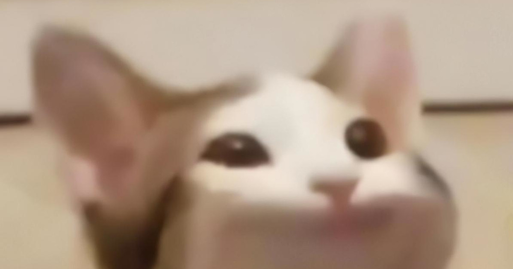

# Popcat Classic

This repository contains the [popcat.click](https://popcat.click) website as it existed on the 11th of December 2020, 17:29 GMT, about 17 and a half hours after its initial commit at 00:06 GMT. 

For its anniversary, we have open sourced and deployed it to [classic.popcat.click](https://classic.popcat.click/). Enjoy!

---

pop **pop** pop *pop* pop pop **pop** **pop** *pop* pop **pop** pop *pop* pop pop **pop** **pop** *pop* pop **pop** pop *pop* pop pop **pop** **pop** *pop* pop **pop** pop *pop* pop pop **pop** **pop** *pop* pop **pop** pop *pop* pop pop **pop** **pop** *pop* pop **pop** pop *pop* pop pop **pop** **pop** *pop* pop **pop** pop *pop* pop pop **pop** **pop** *pop* pop **pop** pop *pop* pop pop **pop** **pop** *pop* pop **pop** pop *pop* pop pop **pop** **pop** *pop* pop **pop** pop *pop* pop pop **pop** **pop** *pop* pop **pop** pop *pop* pop pop **pop** **pop** *pop* pop **pop** pop *pop* pop pop **pop** **pop** *pop* 

pop **pop** pop *pop* pop pop **pop** **pop** *pop* pop **pop** pop *pop* pop pop **pop** **pop** *pop* pop **pop** pop *pop* pop pop **pop** **pop** *pop* pop **pop** pop *pop* pop pop **pop** **pop** *pop* pop **pop** pop *pop* pop pop **pop** **pop** *pop* pop **pop** pop *pop* pop pop **pop** **pop** *pop* pop **pop** pop *pop* pop pop **pop** **pop** *pop* pop **pop** pop *pop* pop pop **pop** **pop** *pop* pop **pop** pop *pop* pop pop **pop** **pop** *pop* pop **pop** pop *pop* pop pop **pop** **pop** *pop* pop **pop** pop *pop* pop pop **pop** **pop** *pop* pop **pop** pop *pop* pop pop **pop** **pop** *pop* 